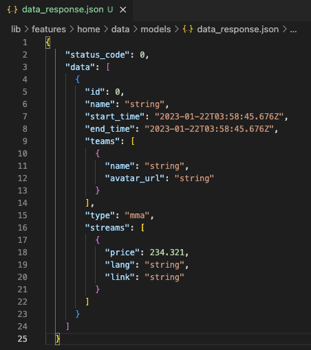
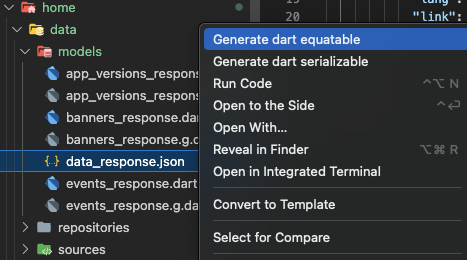

## Features

The extension allows to generate Serilizable & Equatable classes from json file.

## Requirements

- Flutter
- Dart

## Known Issues

- The extension will not generate toMap fromMap for equatable class.

## Release Notes

### 1.0.0

Initial release of the extension